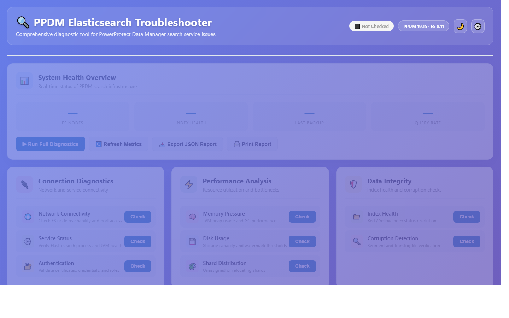

<div align="center">

# 🔍 PPDM Elasticsearch Troubleshooter

**Interactive diagnostic dashboard for PowerProtect Data Manager Elasticsearch access errors**

[](https://github.com/Moodswing9/ppdm-es-troubleshooter/releases)
[](#license)
[](#)
[](#)
[](#getting-started)
[](#-ai-diagnose-nvidia-nim)

</div>

---

<div align="center">



</div>

---

## Overview

A fully self-contained, browser-based diagnostic tool built for engineers and administrators working with **Dell PowerProtect Data Manager (PPDM)** and its embedded Elasticsearch service. No installation, no backend, no build step — open `index.html` and start diagnosing.

---

## Features

### 🧩 10 Diagnostic Check Modules

| Module | Checks Performed |
|:---|:---|
| 🌐 Network Connectivity | DNS resolution · TCP ports 9200 / 9300 · HTTP response time |
| ⚙️ Service Status | ES process · JVM state · thread pools · circuit breakers |
| 🔐 Authentication | Certificate validity · cert chain · basic auth · role permissions |
| 🧠 Memory Pressure | Heap usage · GC rate · fielddata cache · segment memory |
| 💾 Disk Usage | Storage capacity · watermark thresholds · snapshot repo access |
| 🧩 Shard Distribution | Unassigned · relocating · initializing shard counts |
| 📁 Index Health | Red / Yellow index status resolution per index |
| 🔍 Corruption Detection | Segment checksums · translog integrity · Lucene version |
| ⚙️ Search Service Config | PPDM endpoint · index prefix · batch size · retry policy |
| 📋 PPDM Log Analysis | Error rate · index throughput · query failure rate |

### 🛠️ 7 Guided Error-Pattern Workflows

Each workflow delivers **severity-rated**, step-by-step remediation with one-click copy commands:

| Severity | Error Pattern |
|:---:|:---|
| 🔴 High | Connection Refused / Unreachable |
| 🔴 High | Authentication Failed |
| 🔴 Critical | Out of Memory / Circuit Breaker Tripped |
| 🔴 Critical | Disk Full / Watermark Breached |
| 🔴 Critical | Red Cluster Status |
| 🟡 Medium | Query Timeout |
| 🟡 Medium | Search Query Failed |

### ✨ Additional Capabilities

| Capability | Description |
|:---|:---|
| 🌙 Dark Mode | Full light / dark theme toggle |
| 📜 Live Log Stream | Timestamped real-time diagnostic activity viewer |
| ⚙️ Settings Panel | Configure PPDM host, ES host / port, and credentials |
| 📥 JSON Export | Download a full diagnostic snapshot as `.json` |
| 🖨️ Print / PDF | Dedicated print stylesheet for clean report output |
| 🤖 AI Diagnose | Paste a log excerpt; get root cause + remediation steps from Nemotron 70B |

---

## 🤖 AI Diagnose (NVIDIA NIM)

Paste any PPDM or Elasticsearch log excerpt, error message, or symptom description into the **AI Diagnose** panel and get a structured analysis back — root cause, severity, affected component, exact remediation commands, and prevention guidance.

### Pipeline

| Step | Model | Purpose |
|:--|:--|:--|
| 1. **Local regex pass** | — | Strip IPs, emails, and `password=…` style tokens before anything leaves the browser |
| 2. **PII redaction** | `nvidia/gliner-pii` | NER-grade PII detection for hostnames, names, identifiers (with regex fallback if the API is unreachable) |
| 3. **Diagnosis** | `nvidia/llama-3.1-nemotron-70b-instruct` | Returns root cause · severity · affected component · numbered remediation steps with real CLI commands · prevention notes |

### Privacy

- Raw log text **never leaves the browser unredacted** — regex redaction runs first; only the redacted version is sent to NIM
- The dashboard is fully client-side. No backend, no telemetry, no server logs
- Your NVIDIA API key is stored in browser `localStorage` only

### Usage

1. Click ⚙️ → paste your `nvapi-…` key into the **NVIDIA API Key** field → Save
2. Open the AI Diagnose panel (▼ Expand)
3. Paste your log excerpt
4. Click **Analyse** — typical round-trip is 3–6 seconds

The diagnosis output includes copy-pasteable PPDM/ES CLI commands (`mminfo`, `nsradmin`, `curl` against the ES REST API, etc.) so you can act immediately.

---

## Getting Started

```bash
# 1. Clone the repository
git clone https://github.com/Moodswing9/ppdm-es-troubleshooter.git

# 2. Open in your browser — no build step needed
open ppdm-es-troubleshooter/index.html
```

> **Optional:** Click ⚙️ in the header to enter your PPDM and Elasticsearch connection details before running diagnostics.

---

## Project Structure

```
ppdm-es-troubleshooter/
├── index.html              # Application shell and UI markup
├── css/
│   └── styles.css          # Design system — dark mode, print, responsive layout
├── js/
│   ├── data.js             # Diagnostic scenarios and error pattern definitions
│   └── app.js              # Application logic, state management, and export
├── tests/
│   └── dashboard.spec.js   # Playwright smoke tests (Chromium · Firefox · WebKit)
├── playwright.config.js    # Test runner config — runs against local http-server
└── .github/workflows/
    └── playwright.yml      # CI — runs full test matrix on every PR
```

---

## Tests

The dashboard ships with a Playwright smoke-test suite covering page load, the four health-overview metric cards, settings panel, dark mode toggle, diagnostic card rendering, export/print buttons, and zero-console-errors. Tests run on Chromium, Firefox, and WebKit.

```bash
# One-time setup
npm install
npx playwright install

# Run tests headless
npm test

# Watch tests run in a real browser
npm run test:headed

# Step through with the inspector
npm run test:debug

# Open the last HTML report
npm run test:report
```

CI runs the full matrix on every push and PR — see `.github/workflows/playwright.yml`. HTML reports are uploaded as artifacts on every run.

---

## License

Copyright (c) 2026 Timur Poyraz. All rights reserved.

No part of this software may be reproduced, distributed, or modified in any form or by any means without express written permission from the copyright holder.

---

<div align="center">

Built by [Moodswing9](https://github.com/Moodswing9) · [Portfolio](https://moodswing9.github.io)

</div>
